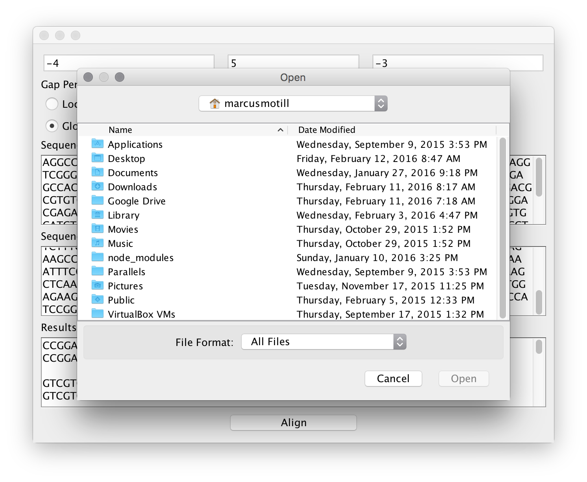
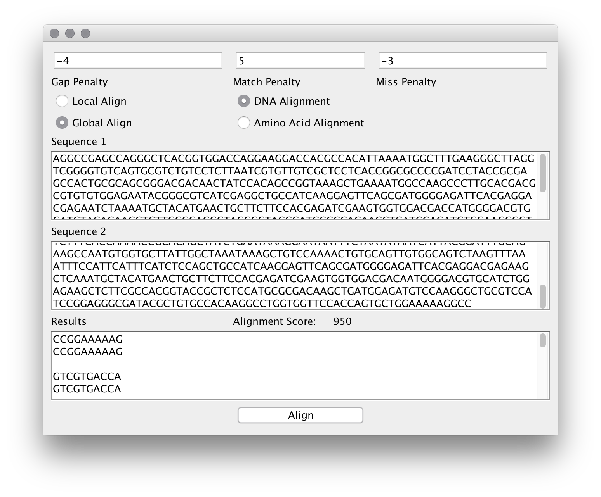
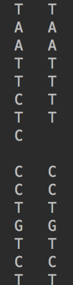

# Dynamic Programming - Marcus Motill
## Bioinformatics Spring 2016
## How to use:
1. Determine scoring schema
2. Select Alignment type
3. Select input type
  - For amino acid select scoring matrix

4. Input FASTA sequence **without description line**
5. Click Align

Should look like this: 

**Note that due to bugs the amino acis alignment is only visible in the IDE console: **

### Sections Completed:
- Global Alignment:
  - User is able to input their own match, mismatch, and gap scores.
- Local Alignment:
  - User is able to input their own match, mismatch, and gap scores.
  - User is able to use any type of scoring matrix they want.
    - See [this file](PAM250.txt) for example of accepted input format.
- Scoring Matrix for amino acid Alignment can be selected by the other after they select "Amino Acid"
  - Use the Supplied PAM250 matrix for examples

### Known Bugs
- Issues printing results:
  - Nucleotide Alignment:
    - Results sometimes do not print in the correct format, for example there will be three lines in a row without being seperated by a new line.
      - This issue comes from the high volume of strings being printed
  - Amino Acid Alignment:
    - Due to unknown issues with reading from a file and then printing to the applet window, **Amino acid alignments can be only viewed in the program console NOT in the GUI**

### Time complexity
Due to the matrix initialization and file scanning the complexity of the program is rather high.

Time complexity of alignment: O(n4)

Time complexity of scoring:
- Nucleotide: O(n2)
- Amino Acid: O(n)
